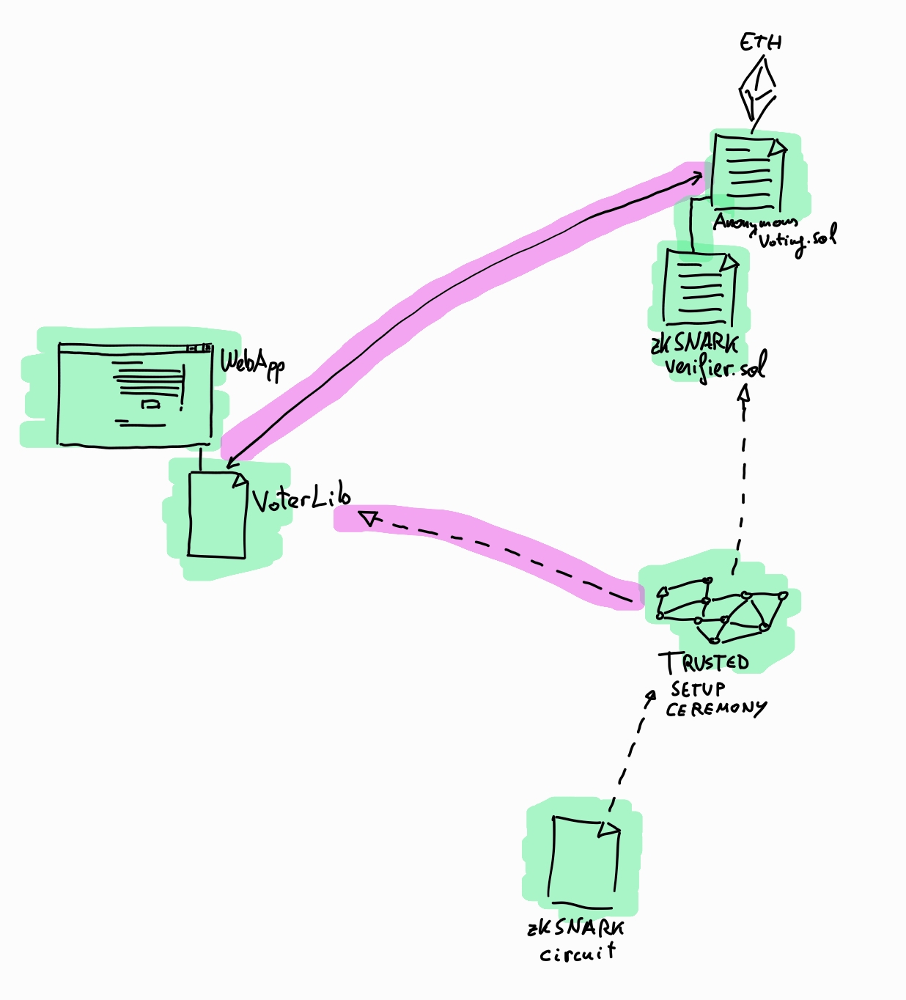
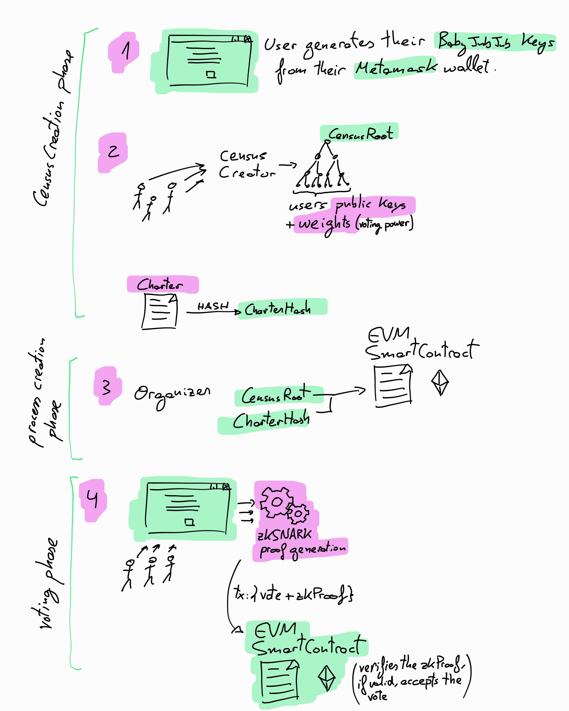

# Overview

zkSNARK proof proves:
- User owns a key which is in the Census MerkleTree
- User signed their vote + the Charter document hash
- User vote has not already been casted

So, the user proves that is in the census but without revealing which key from the census! So the user does not reveal who they are. (Onchain Anonymous Voting)

The SmartContract verifies the zkSNARK proof and if it is correct, accepts the vote on-chain.

## Get started

To run the web app:
```sh
cd packages/app
npm install
npm run dev
```

Open your browser at [localhost:3000](http://localhost:3000)

To bundle the NodeJS-only JS dependencies:

```sh
cd packages/cjs-bundler
make init
make all
make copy
```

### Components



### Flow


